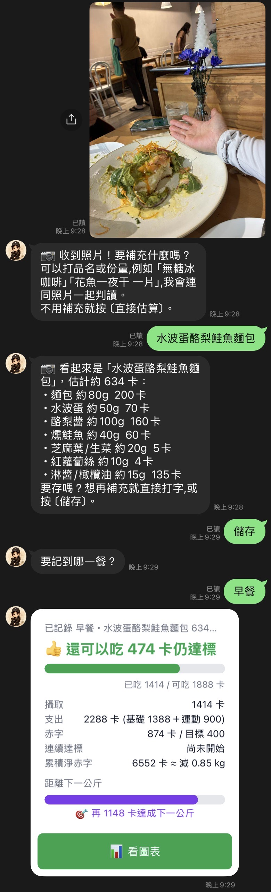

# Calory 🍱

A **LINE chatbot for calorie & weight tracking**, built as a serverless app on Cloudflare Workers. Log meals and exercise by typing a message or **snapping a photo** — a vision model estimates the calories — and get daily "deficit cards", weekly reports, streaks, and an interactive in-LINE chart dashboard.

一個在 **LINE 上記錄熱量與體重的聊天機器人**,以 Cloudflare Workers 無伺服器架構打造。用打字或**拍一張照片**就能記錄飲食與運動——照片由視覺模型估算熱量——並每天回傳「收支卡」、週報、連續達標天數,以及一個內嵌在 LINE 裡的互動式圖表儀表板。

> Traditional-Chinese product UI; the bot lives entirely inside LINE, so there is no separate app to install.
>
> 產品介面為繁體中文;機器人完全運作於 LINE 內,不需另外安裝任何 App。

---

## Demo ｜ 畫面展示

<!--
  Drop your screenshots / GIFs into the docs/ folder using these exact filenames
  (or rename the paths below). Recommended: 2–4 portrait shots ~400px wide.
  截圖請放進 docs/ 並使用以下檔名;建議 2–4 張直式、約 400px 寬。
-->

| Photo → calorie logging ｜ 拍照估算 | Daily deficit card ｜ 每日收支卡 |
|:---:|:---:|
|  |  |

| LIFF chart dashboard ｜ LIFF 圖表儀表板 | Text logging & onboarding ｜ 文字記錄與引導 |
|:---:|:---:|
|  |  |

---

## What it does ｜ 功能

| Feature ｜ 功能 | How it works ｜ 運作方式 |
|---|---|
| **Text logging ｜ 文字記錄** | `早餐 雞胸肉 200` / `運動 跑步 -300` — a deterministic parser turns free text into structured food/exercise entries. Reusable **presets** for frequent meals.<br>一個確定性的解析器把自由文字轉成結構化的飲食/運動紀錄,常吃的餐點可存成**預設**重複使用。 |
| **📷 AI photo estimation ｜ AI 拍照估算** | Send a food photo → Google **Gemini** estimates each item's calories, using hand-size calibration, container-volume cues, and 45° angle correction. User confirms the meal slot before it's logged.<br>傳一張食物照片 → 由 Google **Gemini** 分項估算熱量,並用手掌大小校準、容器體積線索與 45° 斜拍修正;使用者確認餐別後才寫入。 |
| **Personalised onboarding ｜ 個人化引導** | A guided Q&A collects sex, age, height, weight, and activity level, then computes **BMR + TDEE** to set a daily calorie budget.<br>以問答收集性別、年齡、身高、體重與活動量,計算 **BMR + TDEE**,設定每日熱量預算。 |
| **Daily & weekly summaries ｜ 每日與每週摘要** | The "收支卡" (income/expense card) shows calories in vs. out as a Flex Message, with **praise lines** and a **streak counter**. Weekly rollups summarise progress.<br>「收支卡」以 Flex Message 顯示攝取與消耗,搭配**鼓勵語**與**連續達標天數**;週報彙整進度。 |
| **Goal & weight tracking ｜ 目標與體重追蹤** | Set a target weight; the bot tracks logged weights and projects fat loss from **cumulative calorie deficit**.<br>設定目標體重,機器人追蹤體重紀錄並依**累積熱量赤字**推估減脂進度。 |
| **⏰ Scheduled push ｜ 定時推播** | An hourly cron fires per-user reminders (daily report / weekly report / bedtime nudge) in each user's **local timezone**.<br>每小時的 cron 依各使用者**當地時區**推播日報/週報/睡前提醒。 |
| **📊 LIFF dashboard ｜ LIFF 儀表板** | An in-LINE web page (LIFF) renders deficit-trend, weight-line, per-meal, and goal-progress charts as hand-rolled SVG — no charting library, no framework.<br>內嵌於 LINE 的網頁(LIFF),以純手刻 SVG 繪製赤字趨勢、體重曲線、各餐分項與目標進度圖——不用任何圖表函式庫或前端框架。 |

---

## Architecture ｜ 架構

```
        LINE Messaging API                         Google Gemini
                │  (webhook: text / image)               ▲
                ▼                                         │ photo → calories
   ┌─────────────────────────────────────────────────────┴───────┐
   │  Cloudflare Worker  (TypeScript, edge runtime)               │
   │                                                              │
   │  index.ts ─ verifySignature ─► handleEvent (router)          │
   │                                   │                          │
   │              ┌────────────────────┼───────────────────┐      │
   │           handlers/            domain/ (pure logic)   line/   │
   │        log · photo · goal    calories · tdee · streak  Flex   │
   │        weight · today …      schedule · parse …        client │
   │                  │                                     │      │
   │                  └──────────► D1 (SQLite) ◄────────────┘      │
   │                                                              │
   │  [cron]  scheduled() ─► per-user timezone push reminders     │
   └──────────────────────────────────────────────────────────────┘
                │
                ▼
        LIFF dashboard (SVG charts, served as a Text module)
```

**Design principles ｜ 設計原則**

- **Deterministic core, AI at the edges.** All scoring, TDEE math, date/timezone handling, and message parsing are pure, unit-tested functions. The model is only invoked where genuine judgement is needed — estimating calories from an unstructured photo.<br>**核心確定性,AI 只用在邊緣。** 所有計分、TDEE 計算、日期/時區處理與訊息解析都是純函式並有單元測試;只有在真正需要判斷的地方(從非結構化照片估算熱量)才呼叫模型。
- **Clean separation.** `domain/` is framework-free business logic; `handlers/` orchestrate; `line/` owns I/O. Inbound flows through one dispatcher (`handleEvent`) and outbound through one sender (`replyMessage`) — a deliberate "narrow waist".<br>**清楚分層。** `domain/` 是無框架的商業邏輯,`handlers/` 負責編排,`line/` 掌管 I/O;入站統一經 `handleEvent` 分派、出站統一由 `replyMessage` 送出——刻意設計的「窄腰」。
- **Type-safe command dispatch.** Incoming commands route through an exhaustive, statically-typed lookup table: adding a new command without a handler is a *compile error*, not a runtime surprise.<br>**型別安全的指令分派。** 指令透過窮舉、靜態型別的查找表分派;新增指令卻忘了處理器會是*編譯錯誤*,而非執行期才爆。
- **Edge-native & cheap.** Stateless Workers + D1 + cron triggers; no servers to run, scales to zero.<br>**邊緣原生且省成本。** 無狀態 Workers + D1 + cron 觸發;沒有伺服器要顧,可縮放到零。

## Tech stack ｜ 技術棧

`TypeScript` · `Cloudflare Workers` · `Cloudflare D1 (SQLite)` · `Wrangler` · `LINE Messaging API` · `LINE LIFF` · `Google Gemini` · `Vitest`

**124 unit tests** cover the domain logic (calories, TDEE, scheduling, parsing, photo normalisation, dashboard aggregation, signature verification).

**124 個單元測試**涵蓋核心邏輯(熱量、TDEE、排程、解析、照片正規化、儀表板彙整、簽章驗證)。

---

## Project structure ｜ 專案結構

```
worker/
├── src/
│   ├── index.ts            # Worker entry: fetch (webhook) + scheduled (cron)
│   ├── line/               # LINE I/O: webhook router, Flex messages, LIFF id_token verify
│   ├── handlers/           # Per-command orchestration (log, photo, goal, weight, today…)
│   ├── domain/             # Pure logic: tdee, calories, streak, schedule, parse, dashboard
│   ├── ai/gemini.ts        # Photo → calorie estimation
│   ├── db/                 # D1 repository + schema.sql
│   └── web/dashboard.html  # LIFF chart dashboard (vanilla JS + SVG)
└── test/                   # Vitest suites
```

---

## Running locally ｜ 本地執行

> Secrets are **never** committed. Public config lives in `wrangler.toml`; credentials are set via `wrangler secret put` (stored by Cloudflare) or a local `.dev.vars` file (git-ignored).
>
> 機密**永不**進版控。公開設定放在 `wrangler.toml`;憑證以 `wrangler secret put`(由 Cloudflare 保管)或本地 `.dev.vars`(已被 git 忽略)設定。

```bash
cd worker
npm install

# 1. Create the D1 database and apply the schema ｜ 建立 D1 資料庫並套用 schema
npx wrangler d1 create calory-db        # paste the printed database_id into wrangler.toml
npm run db:init                          # local
# npm run db:init:remote                 # production

# 2. Provide secrets (production) ｜ 設定機密(正式環境)
npx wrangler secret put LINE_CHANNEL_SECRET
npx wrangler secret put LINE_CHANNEL_ACCESS_TOKEN
npx wrangler secret put GEMINI_API_KEY

#    …or for local dev, create worker/.dev.vars: ｜ 本地開發則建立 worker/.dev.vars:
#    LINE_CHANNEL_SECRET="..."
#    LINE_CHANNEL_ACCESS_TOKEN="..."
#    GEMINI_API_KEY="..."

# 3. Develop / test / deploy ｜ 開發 / 測試 / 部署
npm run dev          # local Worker
npm test             # 124 unit tests
npm run typecheck
npm run deploy       # publish to Cloudflare
```

Point your LINE channel's webhook URL at the deployed Worker, and you're live.

把 LINE channel 的 webhook URL 指向部署好的 Worker 即可上線。

---

## Notes ｜ 備註

This is a personal project built to explore serverless edge architecture, conversational UX inside LINE, and pragmatic use of a vision model for a real everyday task. Secrets and account-specific resource IDs are kept out of version control by design.

這是一個個人專案,用來探索無伺服器邊緣架構、LINE 內的對話式體驗,以及把視覺模型務實地用在日常任務上。機密與帳號專屬的資源 ID 都刻意排除在版控之外。
