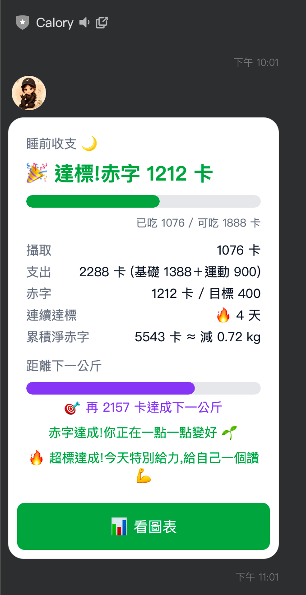
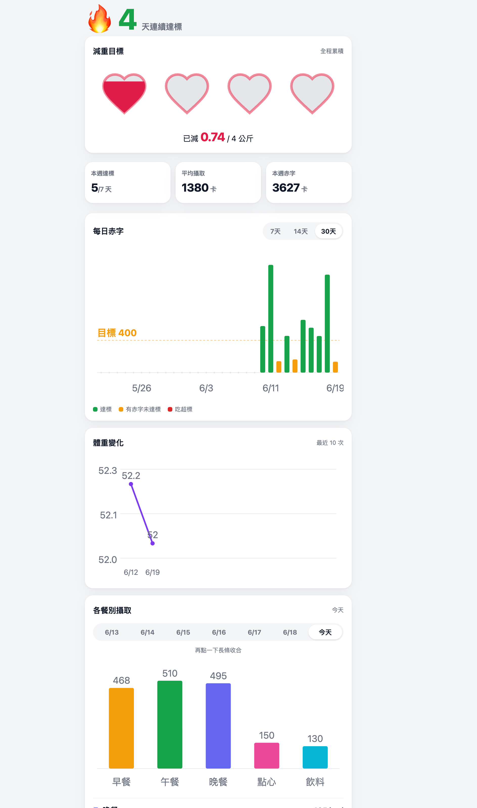
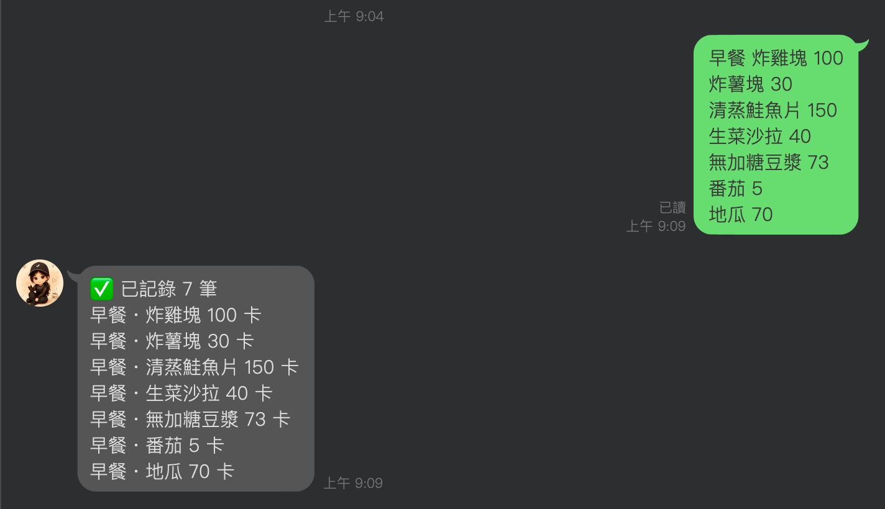

# Calory 🍱

A **LINE chatbot for calorie & weight tracking**, built as a serverless app on Cloudflare Workers. Log meals and exercise by typing a message or **snapping a photo** — a vision model estimates the calories — and get daily "deficit cards", weekly reports, streaks, and an interactive in-LINE chart dashboard.

> Traditional-Chinese product UI; the bot lives entirely inside LINE, so there is no separate app to install.

---

## Demo

<!--
  Drop your screenshots / GIFs into the docs/ folder using these exact filenames
  (or rename the paths below). Recommended: 2–4 portrait shots ~400px wide, or a
  short GIF of the photo-logging flow. PNG or GIF both render on GitHub.
-->

| Photo → calorie logging | Daily deficit card |
|:---:|:---:|
|  |  |

| LIFF chart dashboard | Text logging & onboarding |
|:---:|:---:|
|  |  |

> _Images load once you add them to `docs/`. Until then GitHub shows the alt text — no broken layout._

---

## What it does

| Feature | How it works |
|---|---|
| **Text logging** | `早餐 雞胸肉 200` / `運動 跑步 -300` — a deterministic parser turns free text into structured food/exercise entries. Reusable **presets** for frequent meals. |
| **📷 AI photo estimation** | Send a food photo → Google **Gemini** estimates each item's calories, using hand-size calibration, container-volume cues, and 45° angle correction. User confirms the meal slot before it's logged. |
| **Personalised onboarding** | A guided Q&A collects sex, age, height, weight, and activity level, then computes **BMR + TDEE** to set a daily calorie budget. |
| **Daily & weekly summaries** | "收支卡" (income/expense card) shows calories in vs. out as a Flex Message, with **praise lines** and a **streak counter**. Weekly rollups summarise progress. |
| **Goal & weight tracking** | Set a target weight; the bot tracks logged weights and projects fat loss from **cumulative calorie deficit**. |
| **⏰ Scheduled push** | An hourly cron fires per-user reminders (daily report / weekly report / bedtime nudge) in each user's **local timezone**. |
| **📊 LIFF dashboard** | An in-LINE web page (LIFF) renders deficit-trend, weight-line, per-meal, and goal-progress charts as hand-rolled SVG — no charting library, no framework. |

---

## Architecture

```
        LINE Messaging API                         Google Gemini
                │  (webhook: text / image)               ▲
                ▼                                         │ photo → calories
   ┌─────────────────────────────────────────────────────┴───────┐
   │  Cloudflare Worker  (TypeScript, edge runtime)               │
   │                                                              │
   │  index.ts ─ verifySignature ─► handleEvent (router)          │
   │                                   │                          │
   │              ┌────────────────────┼───────────────────┐      │
   │           handlers/            domain/ (pure logic)   line/   │
   │        log · photo · goal    calories · tdee · streak  Flex   │
   │        weight · today …      schedule · parse …        client │
   │                  │                                     │      │
   │                  └──────────► D1 (SQLite) ◄────────────┘      │
   │                                                              │
   │  [cron]  scheduled() ─► per-user timezone push reminders     │
   └──────────────────────────────────────────────────────────────┘
                │
                ▼
        LIFF dashboard (SVG charts, served as a Text module)
```

**Design principles**

- **Deterministic core, AI at the edges.** All scoring, TDEE math, date/timezone handling, and message parsing are pure, unit-tested functions. The model is only invoked where genuine judgement is needed — estimating calories from an unstructured photo.
- **Clean separation.** `domain/` is framework-free business logic; `handlers/` orchestrate; `line/` owns I/O. Inbound flows through one dispatcher (`handleEvent`) and outbound through one sender (`replyMessage`) — a deliberate "narrow waist".
- **Type-safe command dispatch.** Incoming commands route through an exhaustive, statically-typed lookup table: adding a new command without a handler is a *compile error*, not a runtime surprise.
- **Edge-native & cheap.** Stateless Workers + D1 + cron triggers; no servers to run, scales to zero.

## Tech stack

`TypeScript` · `Cloudflare Workers` · `Cloudflare D1 (SQLite)` · `Wrangler` · `LINE Messaging API` · `LINE LIFF` · `Google Gemini` · `Vitest`

**124 unit tests** cover the domain logic (calories, TDEE, scheduling, parsing, photo normalisation, dashboard aggregation, signature verification).

---

## Project structure

```
worker/
├── src/
│   ├── index.ts            # Worker entry: fetch (webhook) + scheduled (cron)
│   ├── line/               # LINE I/O: webhook router, Flex messages, LIFF id_token verify
│   ├── handlers/           # Per-command orchestration (log, photo, goal, weight, today…)
│   ├── domain/             # Pure logic: tdee, calories, streak, schedule, parse, dashboard
│   ├── ai/gemini.ts        # Photo → calorie estimation
│   ├── db/                 # D1 repository + schema.sql
│   └── web/dashboard.html  # LIFF chart dashboard (vanilla JS + SVG)
└── test/                   # Vitest suites
```

---

## Running locally

> Secrets are **never** committed. Public config lives in `wrangler.toml`; credentials are set via `wrangler secret put` (stored by Cloudflare) or a local `.dev.vars` file (git-ignored).

```bash
cd worker
npm install

# 1. Create the D1 database and apply the schema
npx wrangler d1 create calory-db        # paste the printed database_id into wrangler.toml
npm run db:init                          # local
# npm run db:init:remote                 # production

# 2. Provide secrets (production)
npx wrangler secret put LINE_CHANNEL_SECRET
npx wrangler secret put LINE_CHANNEL_ACCESS_TOKEN
npx wrangler secret put GEMINI_API_KEY

#    …or for local dev, create worker/.dev.vars:
#    LINE_CHANNEL_SECRET="..."
#    LINE_CHANNEL_ACCESS_TOKEN="..."
#    GEMINI_API_KEY="..."

# 3. Develop / test / deploy
npm run dev          # local Worker
npm test             # 124 unit tests
npm run typecheck
npm run deploy       # publish to Cloudflare
```

Point your LINE channel's webhook URL at the deployed Worker, and you're live.

---

## Notes

This is a personal project built to explore serverless edge architecture, conversational UX inside LINE, and pragmatic use of a vision model for a real everyday task. Secrets and account-specific resource IDs are kept out of version control by design.
